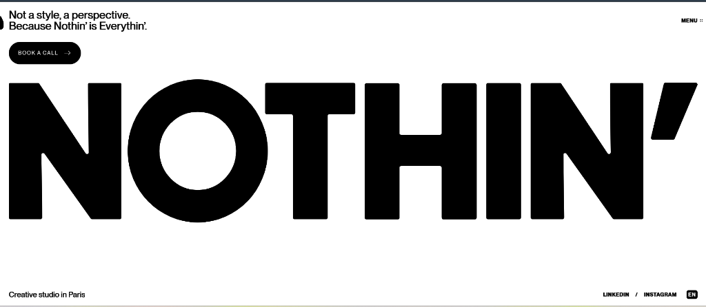

# Noth.in Clone Website

A high-fidelity, responsive recreation of the **Noth.in** website, built with modern web standards, smooth interactions, dynamic animations, and responsive layouts.



## 🚀 Live Demo

- **Live Site**: [https://clone-website-nothin.vercel.app/](https://clone-website-nothin.vercel.app/)
- **GitHub Repository**: [https://github.com/atharvmaske54-ux/clone-website-nothin](https://github.com/atharvmaske54-ux/clone-website-nothin)

## 🛠️ Tech Stack

- **HTML5** — Semantic, clean structure
- **CSS3** — Custom layout, glassmorphism, responsive breakpoints, smooth animations
- **JavaScript (ES6+)** — Interactive logic and animation triggers
- **GSAP & ScrollTrigger** — High-performance scroll-driven and timeline animations

## ✨ Key Features

- **Pixel-Perfect UI**: Recreated design matching the original layout, typography, and aesthetic.
- **Interactive Animations**: Dynamic scroll triggers, hover micro-interactions, and visual transitions.
- **Responsive Layout**: Seamlessly adapts across all viewport sizes (Desktop, Tablet, Mobile).
- **Optimized Performance**: Lightweight asset loading and GPU-accelerated CSS animations.

## 💻 Local Setup

1. **Clone the repository**:
   ```bash
   git clone https://github.com/atharvmaske54-ux/clone-website-nothin.git
   cd clone-website-nothin
   ```

2. **Run locally**:
   Open `index.html` directly in your browser or run a local HTTP server:
   ```bash
   python -m http.server 8080
   # or
   npx serve .
   ```

## 📄 License

This project is created for educational and portfolio presentation purposes.
